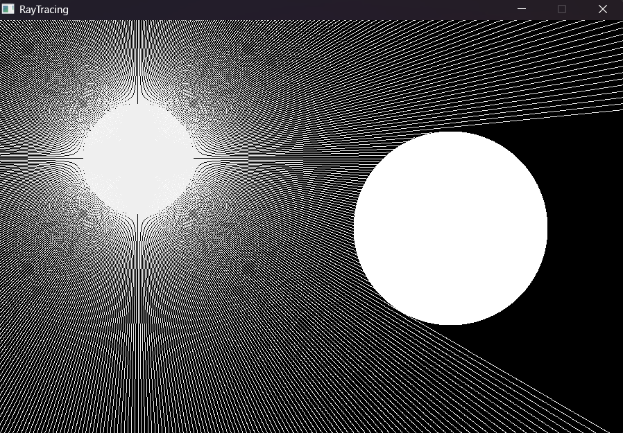

# Ray Tracing Simulation in SDL

This repository contains a **Ray Tracing Simulation** project written in C++ using SDL. The simulation demonstrates real-time ray tracing techniques and how they interact with circular objects on a 2D plane.

## Features

- **Dynamic Circle Rendering**: Draws circles and updates their positions in real-time.
- **Ray Casting**: Simulates rays originating from a point and their interaction with objects.
- **Real-Time Simulation**: Dynamic visualization based on user inputs like mouse movements.

## Code Structure

- **`rayTracing.cpp`**: The main program file containing all the logic for circle rendering, ray casting, and interactions.
- **`SDL3.dll`**: Required SDL3 library file for running the application.

## How to Build and Run

1. **Install Dependencies**:

   - Download and install [SDL3](https://libsdl.org/).

2. **Clone the Repository**:
   ```bash
   git clone https://github.com/DEVELOPERX-coder/RayTracingCPP.git
   cd RayTracingCPP
   ```

````

3. **Build the Project**:
   Compile the code using a C++ compiler such as `g++`:

   ```bash
   g++ -I src/include -o rayTracing rayTracing.cpp -L src/lib -lSDL3
   ```

4. **Run the Application**:
   ```bash
   ./RayTracing
   ```

## How It Works

- A circle is the origin of rays and can be moved dynamically with the mouse.
- Rays interact with objects (circles), and their paths are updated in real time.
- Real-time rendering of shadows and ray-object interactions.

## Demo



## Project Structure

```plaintext
.
├── rayTracing.cpp      # Main program file
├── SDL3.dll            # SDL3 library
├── rayTracing.exe      # Precompiled executable (if applicable)
└── README.md           # Project documentation
```

## License

This project is licensed under the [MIT License](LICENSE).

## Acknowledgments

- Thanks to [SDL](https://libsdl.org/) for their graphics library.
- Inspired by basic ray tracing techniques in graphics programming.
````
